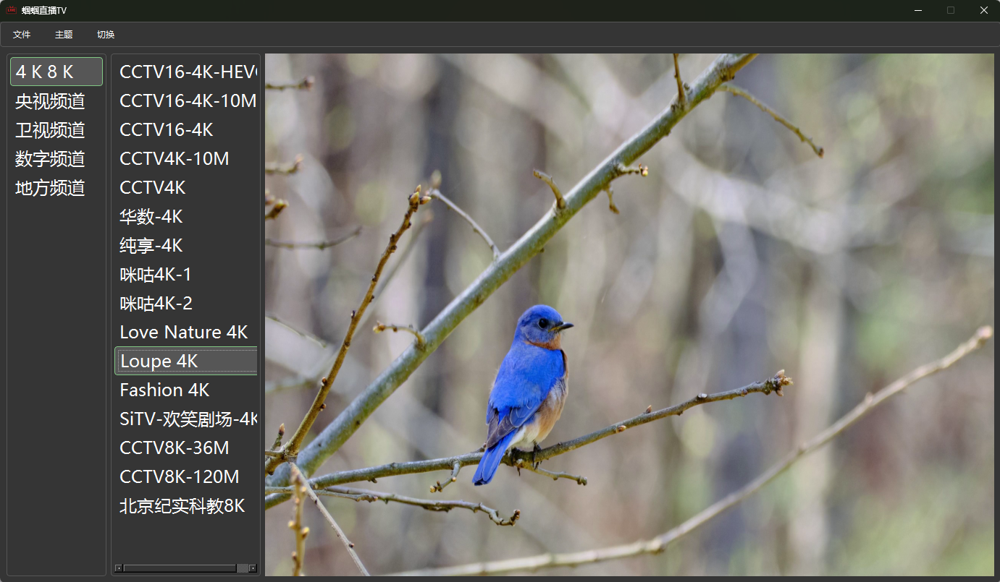

# IPTV Player

## 项目简介

IPTV Player 是一个基于 PySide6 开发的跨平台媒体播放器，支持多种媒体格式的播放，包括直播源、本地视频文件等。它具有简洁的用户界面和丰富的功能。

## 功能特性

- **媒体文件播放**：支持播放各种常见的视频和音频格式。
- **直播源支持**：可读取本地 m3u 文件或在线 m3u 链接作为直播源。
- **频道切换**：通过鼠标滚轮或快捷键快速切换频道。
- **视频录制**：支持实时录像到本地视频文件（暂不支持声音录制）。
- **快捷键操作**：支持多种快捷键，方便用户操作，如全屏/退出全屏、暂停/播放、快退/快进、截图等。
- **界面交互**：支持鼠标单击显示频道菜单，双击全屏播放，支持切换浅色、暗色样式。
- **文件管理**：支持打开各类多媒体文件，支持文件拖拽播放。

## 使用方法

### 播放媒体文件

1. 打开 IPTV Player 应用程序。
2. 点击“打开文件”按钮，选择要播放的媒体文件。
3. 或者直接将媒体文件拖拽到播放器窗口中。

### 加载直播源

1. 点击“加载 M3U”按钮。
2. 选择本地的 m3u 文件或输入在线 m3u 链接。
3. 点击“确定”按钮加载直播源。

### 频道切换

- 使用鼠标滚轮向上或向下滚动切换频道。
- 或者使用快捷键“左右键”快退/快进10秒切换频道。

### 视频录制

1. 点击“录像”按钮开始录制视频。
2. 再次点击“录像”按钮停止录制。

### 快捷键操作

- 回车：全屏/退出全屏
- 空格：暂停/播放
- 左右键：快退/快进10秒
- P：截图
- ESC：退出全屏

## 联系

Email: robin_guo@live.cn
